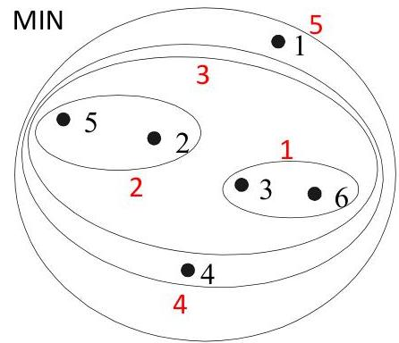
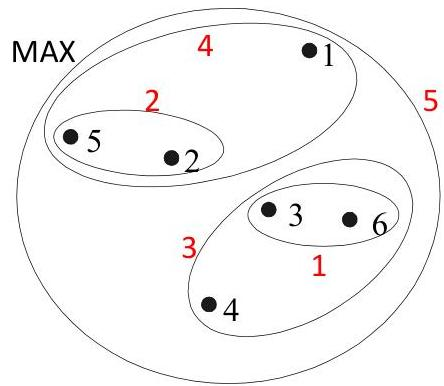
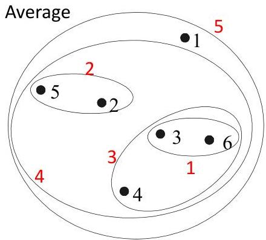
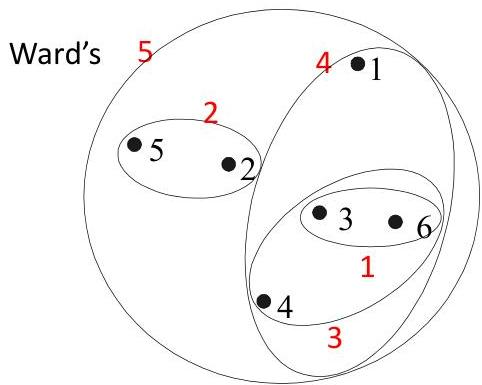

# Hierarchical clustering: comparison

- problems MIN and MAX link can be minimized under average/centroid/Ward link
- strength: less susceptible to noise and outliers
- limitation: biases towards globular clusters

TÉCNICO+

FORMAÇÃO AVANÇADA