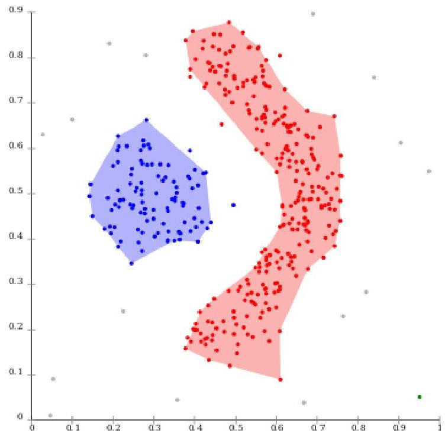

# DBSCAN (density-based clustering)

- clusters are defined as areas of higher density
- separation occurs in sparse areas
- isolated data points here seen as outliers
- advantages? limitations?

TÉCNICO+
FORMAÇÃO AVANÇADA