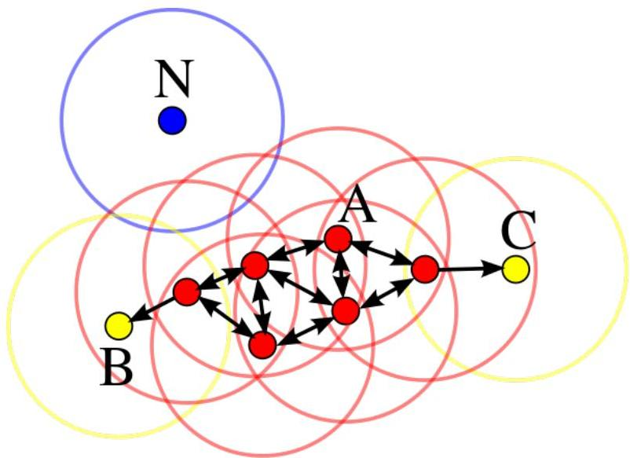

# DBSCAN (density-based clustering)

- parameters
- $\varepsilon$ maximum distance
- $p$ minimum neighbors

- algorithm
- for each point:
- cluster points with $p$
- neighbors at $&lt; \varepsilon$ distance

TÉCNICO+
FORMAÇÃO AVANÇADA