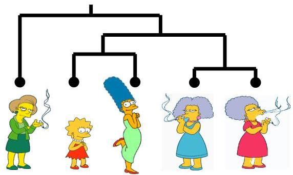

# Motivation

- Patients with a shared clinical condition: How to understand disease?
- cancer types, dementia progression, risk groups
- stratified diagnostics and therapeutics

- Customers: how to segment their profile for personalized marketing?
- Webpages, shopping products, media, documents: how to categorize them for recommendations?
- Genes, proteins and metabolites with different expression and concentration profile: how to understand their correlated behavior (biological functions)?
- Students, researchers, professors: how to improve science and education?

TÉCNICO+
FORMAÇÃO AVANÇADA