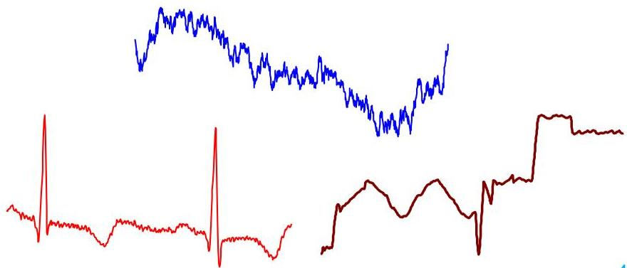

# Time series data

- Time series: sequence of values or symbols along time $\mathbf{s} = \langle \mathbf{x}_1, \ldots, \mathbf{x}_T \rangle$
- univariate or multivariate, $\mathbf{x}_j \in \mathbb{R}^m$ (or $\mathbf{x}_j \in \{Y_1 \ldots Y_m\}$), where $m$ is the multivariate order
- Time series data: $\{\mathbf{s}_1, \ldots, \mathbf{s}_n\}$ where $\mathbf{s}_i$ is a time series
- Time series are ubiquitous: monitoring biological, individual, organizational, geophysical, digital, mechanical, societal systems
- Movement, image and video as time series, text data as time series
- People measure things...
- their blood pressure
- the annual rainfall in New Zealand
- the value of their Yahoo stock
- the number of web hits per second
... and things change over time

TÉCNICO+
FORMAÇÃO AVANÇADA