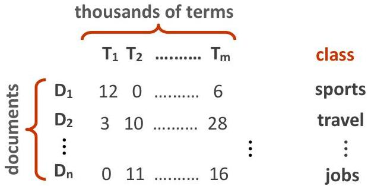

# Text document clustering

- Group related documents based on their content
- the similarity between every string pair is calculated as a basis for determining the clusters
- considering term vector spaces... cosine

- A similarity measure is required to calculate the similarity between two strings

approximate string matching

semantic similarity stem, feature extraction and lexical analysis

TÉCNICO+ FORMAÇÃO AVANÇADA