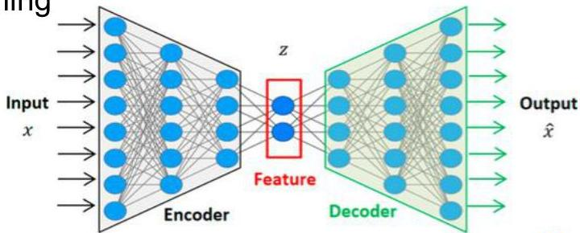

# Representation learning (next class)

These and many other complex data structures may be encountered
- video, events, tensors, heterogeneous data structures...

Two major solutions
- dedicated distances or clustering approaches
- obtain (numeric) representations of these complex observations by extracting features
- features can be extracted using simple statistics
- e.g. extract centrality/variability/slope/max/min statistics on time series using sliding windows
- embeddings can be extracted using representation learning
- example: auto-encoder neural networks can be applied to deal with arbitrary complex inputs

TÉCNICO+
FORMAÇÃO AVANÇADA