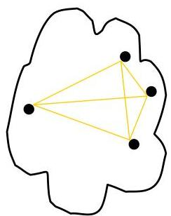
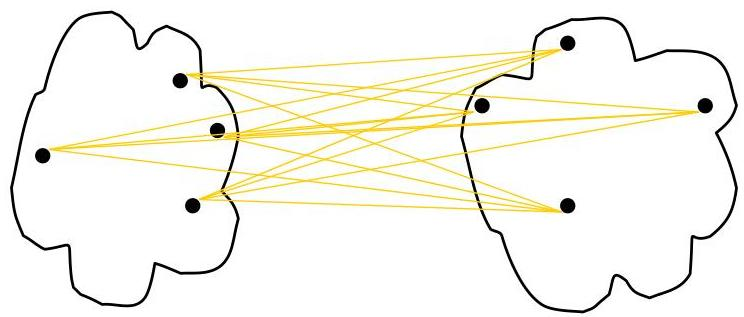

# Internal measures: cohesion and separation

Proximity graph-based approach to measure cohesion and separation

- Cohesion is the sum of the weight of all links within a cluster
- Separation is the sum of the weights between nodes in the cluster and nodes outside the cluster

cohesion

separation

TÉCNICO+
FORMAÇÃO AVANÇADA