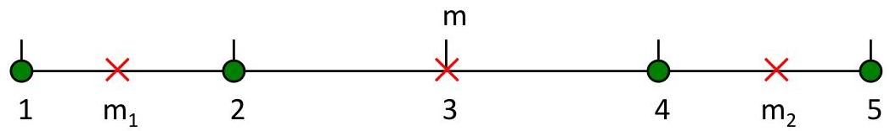

# Internal measures: cohesion and separation

SSB + SSE = constant

K=1 cluster:
$$
SSE = (1 - 3)^2 + (2 - 3)^2 + (4 - 3)^2 + (5 - 3)^2 = 10
$$
$$
SSB = 4 \times (3 - 3)^2 = 0
$$
$$
Total = 10 + 0 = 10
$$

K=2 clusters:
$$
SSE = (1 - 1.5)^2 + (2 - 1.5)^2 + (4 - 4.5)^2 + (5 - 4.5)^2 = 1
$$
$$
SSB = 2 \times (3 - 1.5)^2 + 2 \times (4.5 - 3)^2 = 9
$$
$$
Total = 1 + 9 = 10
$$

TÉCNICO+ FORMAÇÃO AVANÇADA