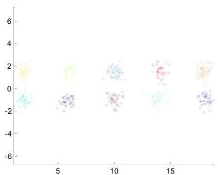
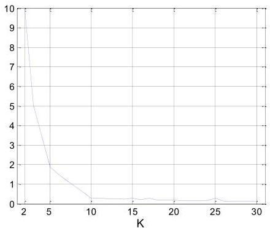

# Internal measures: cohesion

- For each observation, the error is the distance to the nearest cluster
- Square these errors (to penalize larger distances) and sum these errors

$$
SSE = \sum_{k=1}^{K} \sum_{x_i \in C_k} d(x_i, c_k)^2
$$

- Good to compare two clustering solutions or two clusters
- Can also be used to estimate the number of clusters

TÉCNICO+

FORMAÇÃO AVANÇADA