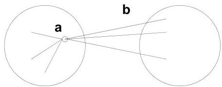
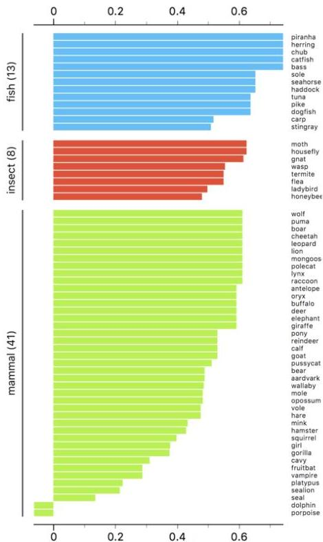

# Internal measures: silhouette coefficient

- Combine ideas of both cohesion and separation
- Calculated for a specific object $\mathbf{x}_i$
- $a =$ average distance of $\mathbf{x}_i$ to the points in its cluster
- $b = \min$ (average distance of $\mathbf{x}_i$ to points in another cluster)
- the silhouette coefficient for a point is then given by

$$
s = 1 - a / b \quad \text{if } a &lt; b, \quad \text{(or } s = b / a - 1 \text{ if } a \geq b, \text{ not the usual case)}
$$

between $-1$ and $1$ (the closer to 1 the better)

- Silhouette of cluster and clustering solution: average of silhouettes

TÉCNICO+

FORMAÇÃO AVANÇADA