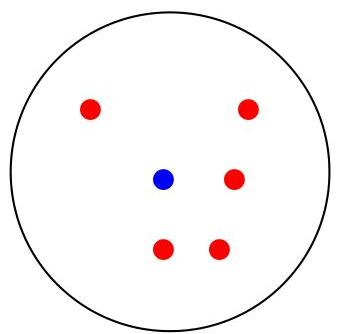
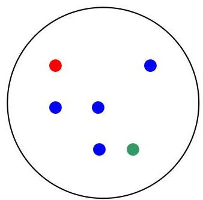
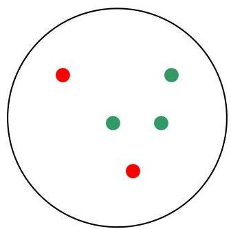

# External measures: purity

cluster I

cluster II

cluster III

cluster I: purity = 1/6 (max(5, 1, 0)) = 5/6
cluster II: purity = 1/6 (max(1, 4, 1)) = 4/6
cluster III: purity = 1/5 (max(2, 0, 3)) = 3/5
solution: purity = 1/17 (5+4+3) = 12/17

TÉCNICO+
FORMAÇÃO AVANÇADA