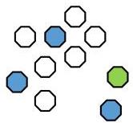

# Clustering modes

- Unsupervised (default)
- cluster observations without knowing their labels

- Semi-supervised
- cluster observations when:
- the labels of some observations may be known or
- pairs of observations are known to belong to the same cluster

- Supervised
- cluster observations when targets are considered, e.g.:
- label added as an additional input variable
- cluster class-conditional observations

TÉCNICO+
FORMAÇÃO AVANÇADA