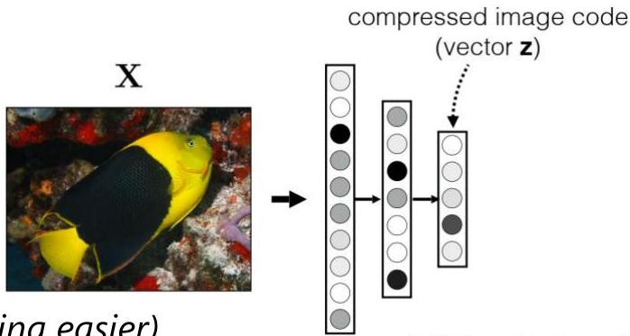
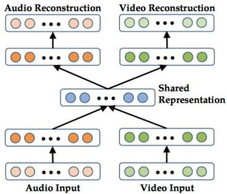

# Numeric encodings of complex data

- A good representation is:
- compact (minimal)
- explanatory (sufficient)
- disentangled (independent factors)
- informative (make subsequent problem solving easier)

- How to learn numeric representations from complex data?
- neural networks $\Rightarrow$ check our class on representation learning!

- Implications?
- classic distances can be applied
- yet given the above properties: cosine distance recommended

TÉCNICO+

FORMAÇÃO AVANÇADA