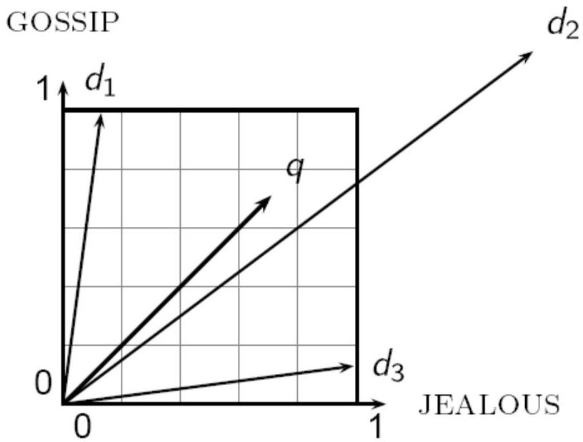

# Distances vs correlation

- Consider the scenario where you have three documents (observations): $d_{1}, d_{2}$ and $d_{3}$
- each document is characterized by the frequency of terms in the text (features)
- Now consider we enter a query $q$ to retrieve documents similar to $q$
- Euclidean distance is... a bad idea as it is large for vectors of different lengths
- the Euclidean distance between $q$ and $d_{2}$ is large even though the distribution of terms in the query $q$ and $d_{2}$ are very similar

TÉCNICO+
FORMAÇÃO AVANÇADA