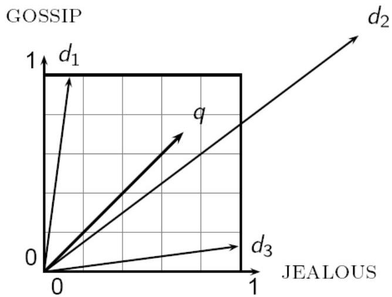
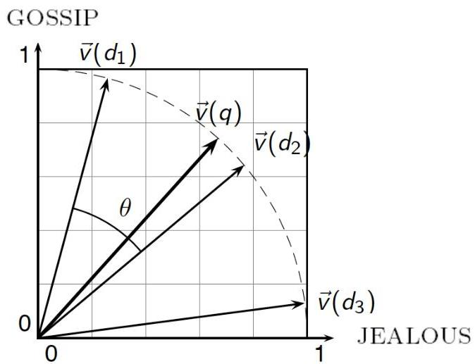

# Vector norm

The normalization of an observation, should not be mislead with variable normalization

- variable normalization guarantees that the measurements of a given variable yield statistical properties of interest, e.g. [0,1] or N(0,1)

TÉCNICO+

FORMAÇÃO AVANÇADA