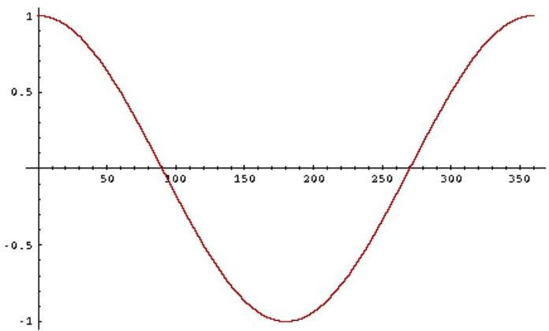

# From angles to cosines

- the following two notions are equivalent:
- distance of the angle between two vectors
- similarity of the cosine between two vectors
- cosine is a monotonically decreasing function for the interval $[0^{\circ}, 180^{\circ}]$

TÉCNICO+
FORMAÇÃO AVANÇADA