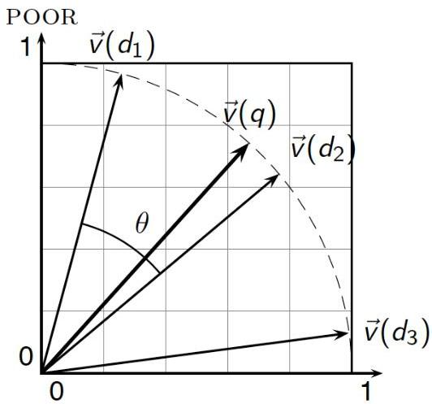

# Cosine similarity

$$
\cos (\mathbf {x} _ {1}, \mathbf {x} _ {2}) = \frac {\mathbf {x} _ {1} \cdot \mathbf {x} _ {2}}{\| \mathbf {x} _ {1} \| \| \mathbf {x} _ {2} \|} = \frac {\sum_ {i} x _ {1 i} x _ {2 i}}{\sqrt {\sum_ {i} x _ {1 i} {} ^ {2}} \sqrt {\sum_ {i} x _ {2 i} {} ^ {2}}}
$$

- $x_{1i}$ is the feature from variable $y_{i}$ in observation $\mathbf{x}_{1}$
- $\| \mathbf{x}_1\|$ and $\| \mathbf{x}_2\|$ are 2-norm lengths of vectors $\mathbf{x}_1$ and $\mathbf{x}_2$
- $\cos (\mathbf{x}_1,\mathbf{x}_2)$ is the (cosine) similarity of $\mathbf{x}_1$ and $\mathbf{x}_2$

RICH

For length-normalized vectors, cosine similarity is simply the dot product (or scalar product):

$$
\cos (\mathbf {x} _ {1}, \mathbf {x} _ {2}) = \mathbf {x} _ {1} \cdot \mathbf {x} _ {2} = \sum_ {i = 1} ^ {m} x _ {1 i} x _ {2 i}
$$

TÉCNICO+

FORMAÇÃO AVANÇADA