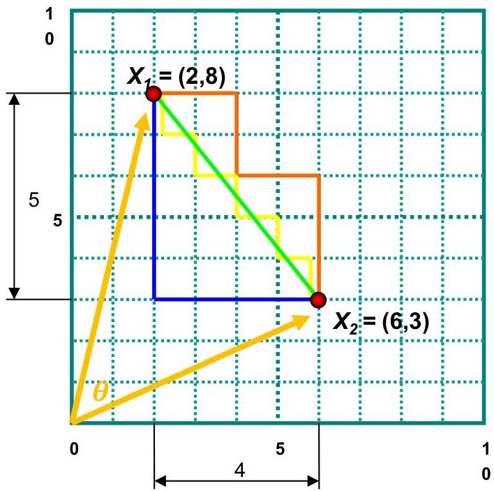

# Cosine similarity

Euclidean distance

$$
l _ {2} \left(\mathbf {x} _ {1}, \mathbf {x} _ {2}\right) = \sqrt {\left| 2 - 6 \right| ^ {2} + \left| 8 - 3 \right| ^ {2}} = \sqrt {4 1}
$$

Manhattan distance

$$
l _ {1} \left(\mathbf {x} _ {1}, \mathbf {x} _ {2}\right) = | 2 - 6 | + | 8 - 3 | = 9
$$

Cosine similarity

$$
\cos (\mathbf {x} _ {1}, \mathbf {x} _ {2}) = \frac {\mathbf {x} _ {1} \cdot \mathbf {x} _ {2}}{\| \mathbf {x} _ {1} \| \| \mathbf {x} _ {2} \|} = \frac {2 \times 6 + 8 \times 3}{\sqrt {2 ^ {2} + 8 ^ {2}} \sqrt {6 ^ {2} + 3 ^ {2}}} = 0.65
$$

15

TÉCNICO+

FORMAÇÃO AVANÇADA