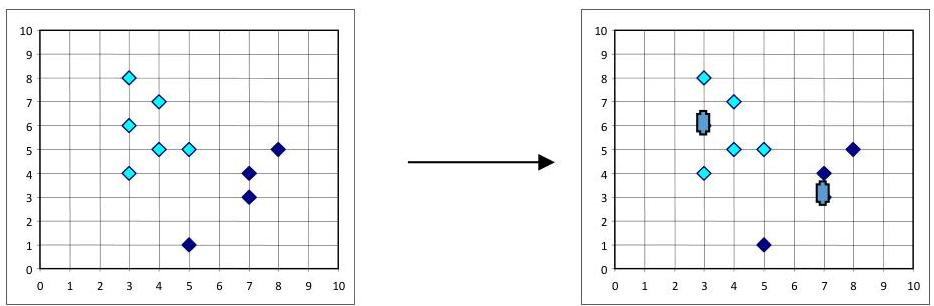

# k-medoids

- numeric data: centroid as the mean or median
- categoric data: centroid as the mode – $k$-modes [Huang'98]
- frequency-based procedure to update modes of clusters
- mixed data: centroid combining mean and modes ($k$-prototype)
- $k$-medoids: the most centrally located observation in a cluster is the centroid
- observation with minimum average distance to all observations in the cluster
- What is the algorithm most robust to outliers: $k$-means or $k$-medoids?

TÉCNICO+
FORMAÇÃO AVANÇADA