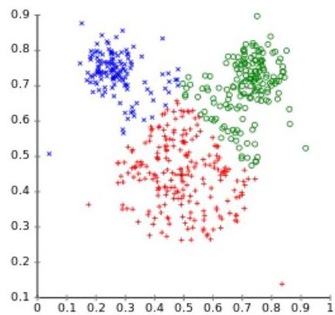
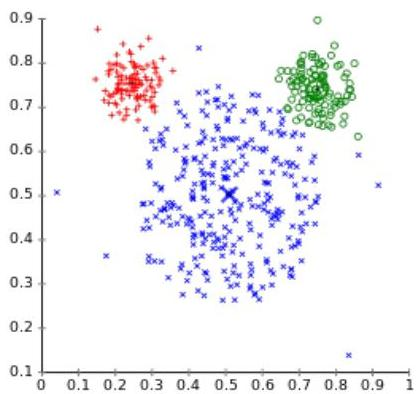
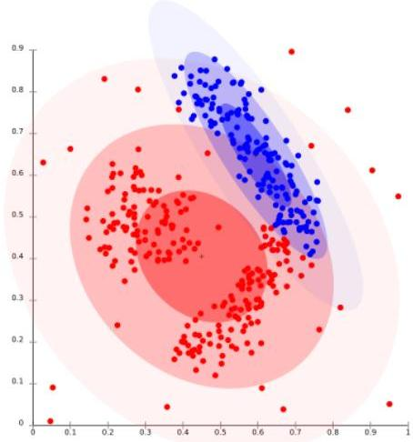

# Model-based vs partitioning approaches

- $k$-means algorithm performs a **hard assignment** of data points to clusters, in which each data point is associated uniquely with one cluster
- in $k$-means the shape of the cluster is described by Euclidean distance function
- Model-based clustering makes a **soft assignment** based on the posterior probabilities
- Expectation Maximization (EM) is the paradigmatic algorithm

k-Means Clustering

EM Clustering

