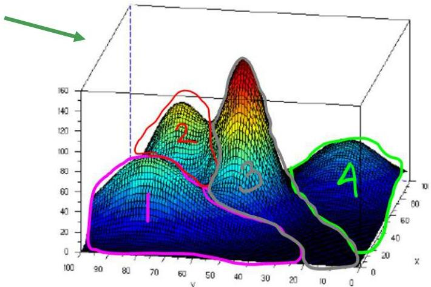

# EM: principles

- Fix the number of clusters, assume each cluster follows a specific distribution
- multivariate Gaussian mixture for numeric variables
- frequentist view for discrete variables
- joint probabilities under independence assumption for mixed data

- EM algorithm
- Iterate between two steps until convergence
- Expectation step: assign observations to clusters
- Maximation step: update the model parameters (adjust distributions)

TÉCNICO+
FORMAÇÃO AVANÇADA