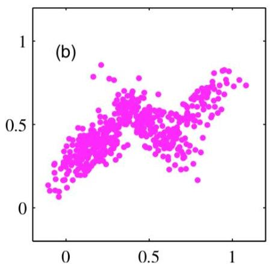
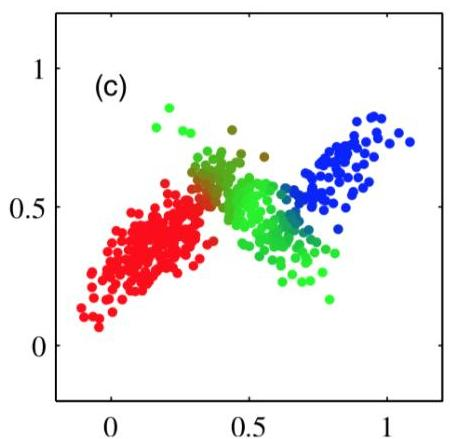
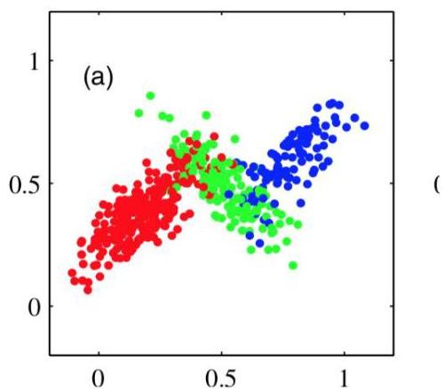

# EM and soft clustering

- each observation has a likelihood of being generate by every cluster, $p(\mathbf{x}|c)$
- can be assigned to the cluster with higher likelihood, $\argmax_c p(c|\mathbf{x})$
- can be assigned to more than one cluster (if both satisfy minimum likelihood) or none
- tackles major problems of density-based approaches (e.g. DBSCAN cannot partition data below)

TÉCNICO+

FORMAÇÃO AVANÇADA