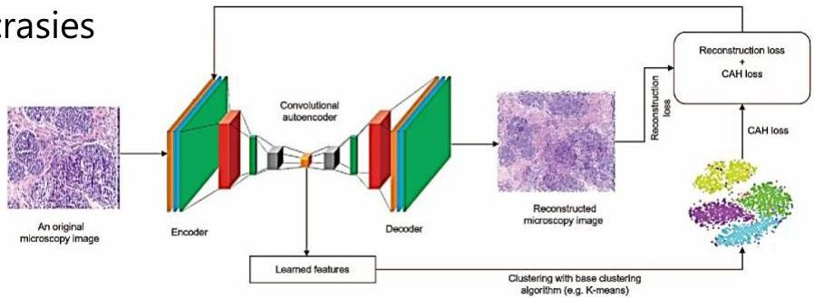

# Deep learning approaches

- Check our presentation on representation learning to recover the foundations!
- Two major paradigms

1. learn good representations from data (whether simple or complex data structures) using deep learning followed by classic clustering stances (e.g. $k$-means)

- addresses data idiosyncrasies (e.g., non-iid variables)

2. apply emerging end-to-end deep learning pipelines for clustering

TÉCNICO+ FORMAÇÃO AVANÇADA