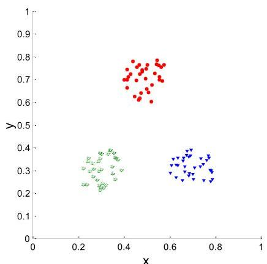
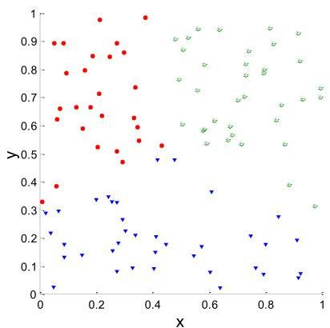
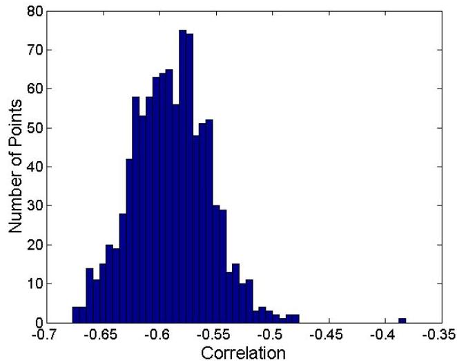

# Statistical significance

- Are correlations of -0.92 and -0.58 statistically significant?
- Histogram shows correlation on randomized data with K-means

Corr = -0.9235

Corr = -0.5810

TÉCNICO+
FORMAÇÃO AVANÇADA