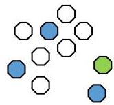

# Recall: clustering modes

- memberships: **hard** (observation belongs to a single cluster) versus **soft** (each observation has a probability of belonging to each cluster – e.g. fuzzy, model-based clustering)
- supervision
- **unsupervised** (default): cluster observations without knowing their outcome variable
- **semi-supervised**: cluster observations when labels of some observations may be known or pairs of observations are known to belong to the same cluster
- “supervised”: cluster observations in the presence of variables of interest (e.g. targets as inputs, class-conditional clustering)
- separation of clusters: **exclusive** versus **non-exclusive** (overlapping clusters)
- **complete** versus **partial** (cluster some objects)
- uniform versus **weighted attributes** or observations

TÉCNICO+
FORMAÇÃO AVANÇADA