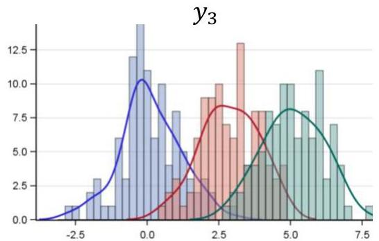

# Visualizing clustering solutions

Key principles for knowledge discovery (to be mastered during our course!)

- Retrieve the **centroids** and/or **medoids**
- Compute the **cluster-conditional distributions** for the most relevant variables

$y_{7}$   $y_{12}$

··· ···

- Retrieve **observation memberships/distances** to each cluster/centroid

TÉCNICO+

FORMAÇÃO AVANÇADA