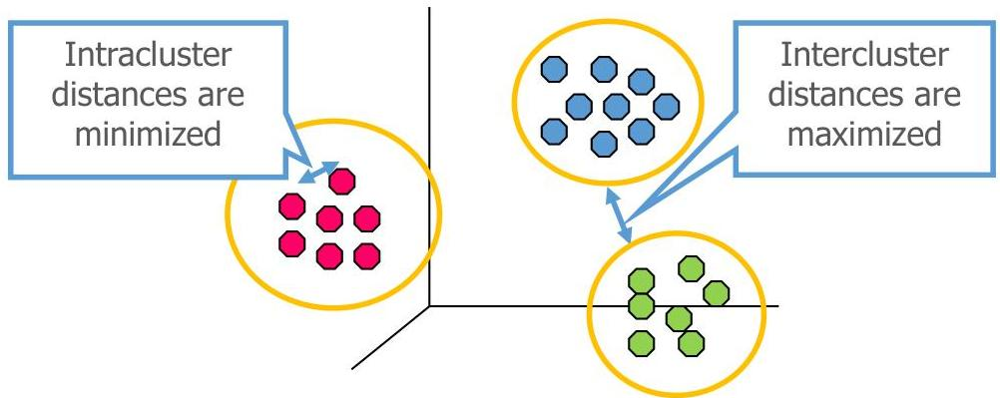

# Recall: clustering

Cluster: group of observations

Cluster analysis: group observations into clusters according to their (dis)similarity: observations in the same cluster are more similar than those in different clusters

Main ingredients for clustering: distance + approach

TÉCNICO+
FORMAÇÃO AVANÇADA