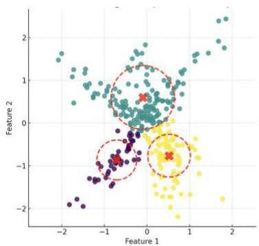
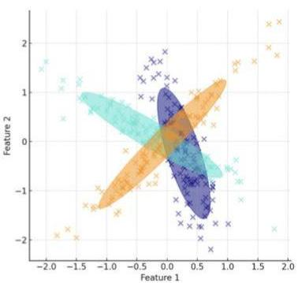

# Visualizing clustering solutions

Key principles for knowledge discovery (to be mastered during our course!)

- Most informative variables? The ones that were better separated by the clusters
- add a column with clusters to the dataset
- run ANOVA (f-classif in sklearn) to assess the discriminative power of each input variable
- use p-values to rank variables by importance

- Visualize clustering solutions in a 2D or 3D space
- select specific features of interest (importance or domain knowledge)
- project the original m-dimensional space into a 2D or 3D space using uMAP, PCA, tSNE

TÉCNICO+
FORMAÇÃO AVANÇADA