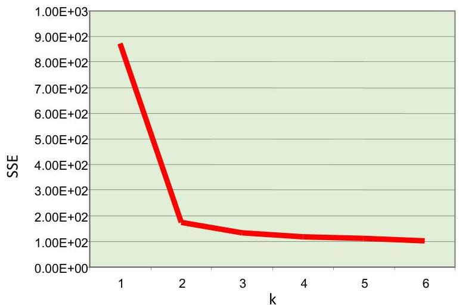

# Number of clusters?

## Knee/elbow method:
- plot the SSE for different $k$
- find the elbow. Example: abrupt changes (k=2) are highly suggestive of two clusters in the data

## Other methods
- plot metrics less sensitive to the #clusters (e.g., silhouette)
- find the k with maximum value or higher neighborhood average centered on k

TÉCNICO+
FORMAÇÃO AVANÇADA