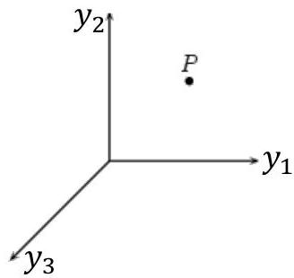
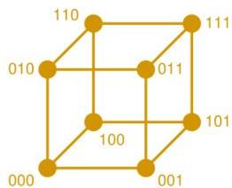

# Categorical features

How do we represent categorical features in a multivariate space?

- Let us start with **binary variables** (e.g. gender)
- a binary feature can be mapped into one axis in a $m$-dimensional space where values are constrained to 0 or 1

- **Ordinal variables** (e.g. high-moderate-low)
- we can find a numeric encoding $f$ for an ordinal variable
- e.g. $f(high) = 5$, $f(moderate) = 1$, $f(low) = 0$
- in the absence of an encoding, one can assume equally spaced integers (e.g. 0, 1, 2...). Problems?

- Let us finally consider **nominal variables** with cardinality higher than 2 (e.g. Europe, Africa, America)
- challenge? As there is no order, we cannot position values along a single axis/dimension
- solution? Create $p$ axes for a nominal variable with cardinality $p$
- only one of the $p$ axes is active (1), while remaining are inactive (0)
- this operation is called **dummification**
- some machine learning methods depend on dummification

6