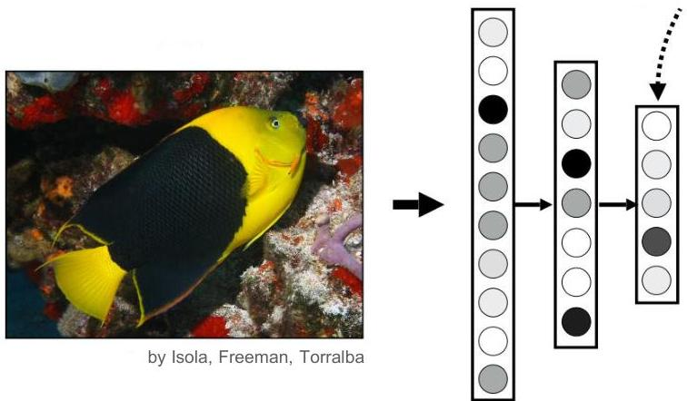

# Numeric representations

- Goal: capture underlying explanatory factors attending to their specific constraints
- coverage, invariance, hierarchy, disentanglement, diversity, sparsity, smoothness...
- Clue: numeric representations may offer interesting properties!
- Still: some hard trade-offs
- attaining coverage (preserving as much input information) together with nice properties (e.g., feature independence, sparsity, invariance)
- It seems a hard task! How to?

compressed image code

TÉCNICO+
FORMAÇÃO AVANÇADA