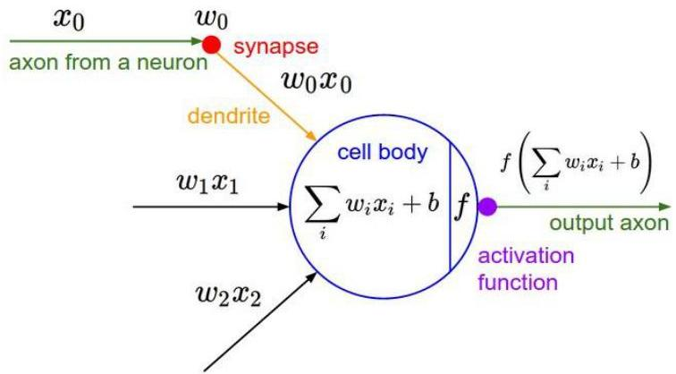

# Neurons...

- Central unit of our brain: neuron
- Computational peer: perceptron (node)
- given an input signal: set of features
$$
\mathbf{x} = (x_1, \dots, x_m)
$$
- returns an output quantity: weighted sum
$$
z = w_0 + \sum_{i=1}^{m} w_i x_i
$$
(linear function of input features)
- Learning a perceptron $f: X \to Z \ldots$
- iteratively adjusting the parameters (weights)
$$
\mathbf{w} = (w_1, \dots, w_m)
$$
from pairs $\{(\mathbf{x}_1, z_1), \dots, (\mathbf{x}_n, z_n)\}$

TÉCNICO+
FORMAÇÃO AVANÇADA