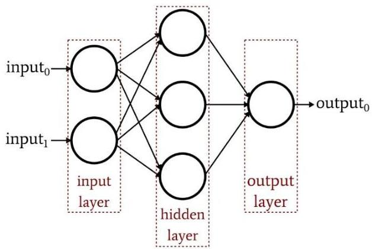

# Neural networks

- Yet... most real-world predictive and descriptive problems not well described by linear functions
- And indeed... our brain is a complex connectome
- $10^{40}$ neurons
- $10^{4-5}$ connections per neuron
- necessary for neuroplasticity: learning and memory
- In maths, we can compose **linear** functions, $f(x)$ and $h(x)$, to form a **non-linear** function, $c(f(x), h(x))$ for modeling more complex behavior
- How to compose neurons (nodes)?
- the composition can be **organized** in **layers**
- the outputs of each node in one layer feeds the input of the nodes in the next layer

TÉCNICO+
FORMAÇÃO AVANÇADA