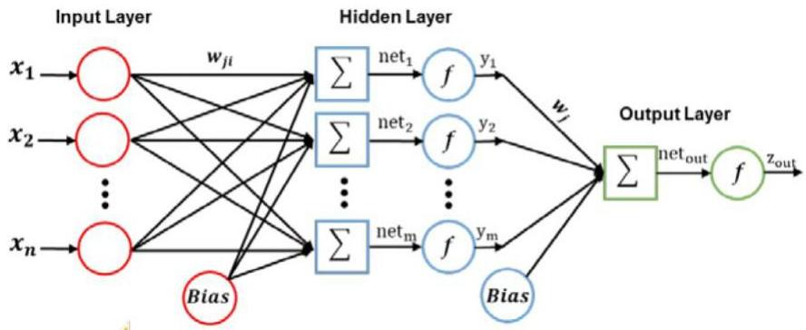

# Non-linear models

Multiple layers of cascade linear units still produce only linear functions

$$
z_{out} = \sum w \left(\sum w x_i\right)
$$

- Solution?

$$
z_{out} = f \left(\sum w f \left(\sum w x_i\right)\right)
$$

16

TÉCNICO+

FORMAÇÃO AVANÇADA