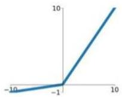
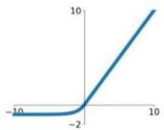

# Activation functions

A large part of the expressiveness of networks are driven by the $f$ functions, termed **activations**

Sigmoid

$$
\sigma(x) = \frac{1}{1 + e^{-x}}
$$

tanh

$$
\tanh(x)
$$

ReLU

$$
\max(0, x)
$$

Leaky ReLU

$$
\max(0.1x, x)
$$

Maxout

$$
\max(w_1^T x + b_1, w_2^T x + b_2)
$$

ELU

$$
\left\{ \begin{array}{ll}
x &amp; x \geq 0 \\
\alpha(e^x - 1) &amp; x &lt; 0
\end{array} \right.
$$

TÉCNICO+

FORMAÇÃO AVANÇADA