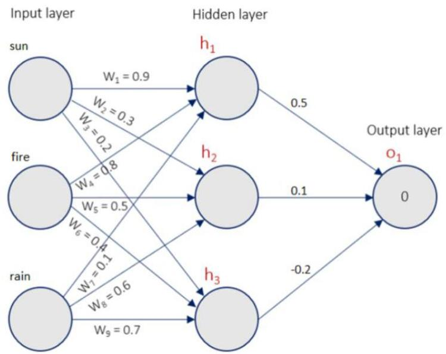

# Exercise moment

Consider the following multilayer perceptron:

- trained on pairs (document, graded relevance)
- inputs: frequencies of specific terms in a document
- output: how likely a document covers natural catastrophes
- all biases as zero ($w_0 = 0$) and rectifier (ReLU) activation on the hidden and output nodes where $ReLU(x) = \max(0, x)$

Exercise: score document $\mathbf{x}$ knowing the frequencies of sun, fire and rain are 1, 0 and 2, i.e. $\mathbf{x} = (1,0,2)$

Solution: a simple propagation step is necessary

$$
\begin{array}{l}
\hat{z} = 0.5 \times h_1 + 0.1 \times h_2 - 0.2 \times h_3 \\
= 0.5 \times (\max(0, 0.9 \times 1) + \max(0, 0.8 \times 0) + \max(0, 0.1 \times 4)) + 0.1 \times (\dots) - 0.2 \times (\dots) = 0.7
\end{array}
$$

18