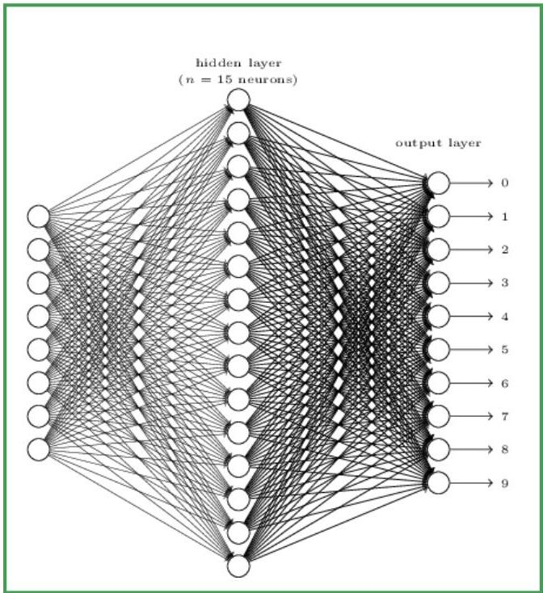

# Neural networks for predictive tasks

- The previous neural networks can be used for:
- single-output regression (estimate quantity)
- binary classification (output above a given threshold $\theta$)

- Neural networks can have multiple output nodes:
- each output is a category in multi-class classification (e.g., document categorization, digit recognition)
- the output category is the node with highest value
- multiple-output prediction, i.e. multiple targets (e.g., autonomous driving – speed and direction)

TÉCNICO+
FORMAÇÃO AVANÇADA