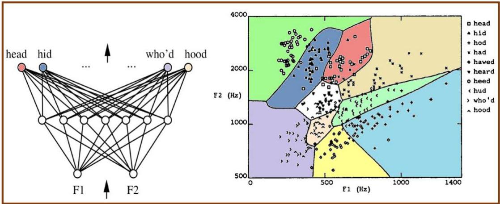
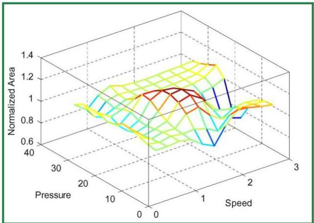

# Expressive boundaries

- Non-linear (often non-convex) predictors
- expressive *hyperboundaries* in classification problems (*left*)
- expressive *hypersurfaces* in regression problems (*right*)

TÉCNICO+
FORMAÇÃO AVANÇADA