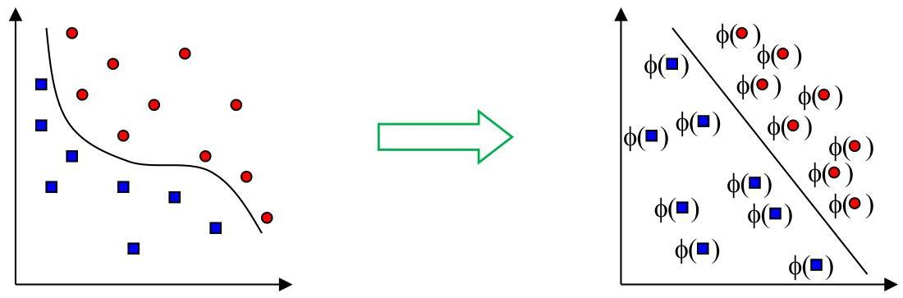

# Neural processing layers as transformations

- A layer $[p]$ can be seen as a non-linear mapping, transforming the input signal $\mathbf{x}^{[p - 1]}$ into a new signal $\mathbf{x}^{[p]}$

$$
\mathbf {x} ^ {[ p ]} = \phi (\mathbf {W} ^ {[ p ]} \mathbf {x} ^ {[ p - 1 ]} + \mathbf {b} ^ {[ p ]})
$$

TÉCNICO+

FORMAÇÃO AVANÇADA