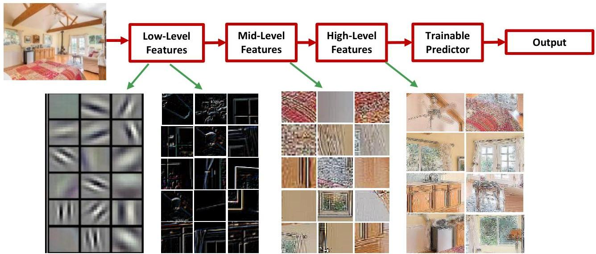

# From single to multiple hidden layers

Multi-layer learning process to extract rich features (good data representations)

- image: pixels → edges → textures → motifs → parts → objects
- text: character → word → word group → clause → sentence → story

TÉCNICO+
FORMAÇÃO AVANÇADA
by Param Vir Singh