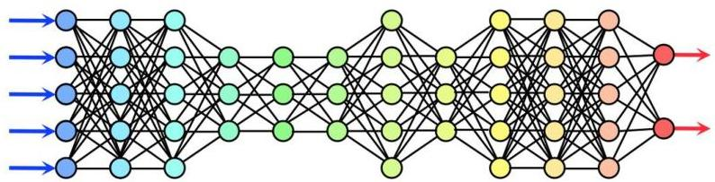

# Deep Learning

- DL is a ML subfield dedicated to the learning of models with a high number of parameters
- paradigmatic case: neural networks (deep in reference to the #layers and/or #parameters)
- Mathematically: shallow NNs (few layers, high #nodes per layer) should be as good as deeper NNs
- the fact that deep NNs work better is empirical: better convergence and computational scalability
- Advantages of deep NNs
- outperform other ML techniques in many tasks
- expressivity to learn from high-dimensional data (including image, text, signal)
- effective end-to-end learning system (can bypass the need for explicit feature extraction)
- Challenges of deep NNs: larger amounts of data required, prone to overfitting (regularization necessary)

TÉCNICO+
FORMAÇÃO AVANÇADA