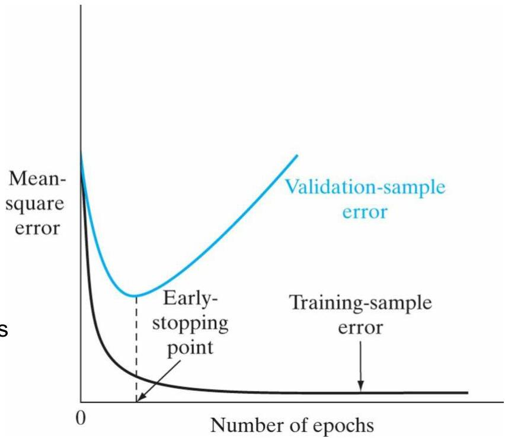

# Convergence: early stopping

- We can keep optimizing the network weights...
... until the network perfectly overfits the training data, hampering the ability to generalize to unseen data

- One possible solution? Early stopping
- stop convergence before MLP overfits data
- how?
- optimize weights with training data, yet assess the loss on a validation set
- stop learning when the validation error increases along few iterations (evidence of overfitting)

- Deep networks? Still provide a max number of epochs!

TÉCNICO+
FORMAÇÃO AVANÇADA