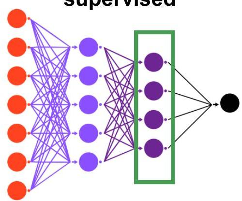
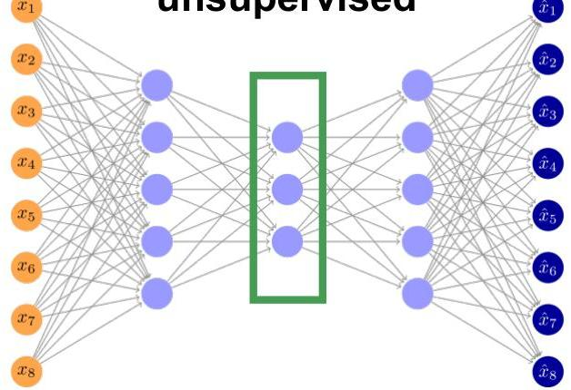

# NNs for Representation Learning

- Two major schools for obtaining a numeric representation (termed embedding):

supervised

unsupervised

- Hybrid variants: network with supervised and unsupervised paths

TÉCNICO+
FORMAÇÃO AVANÇADA
27