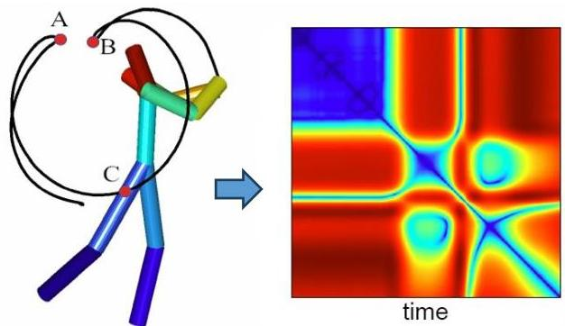

# Representation Learning

- Good features essential for successful descriptive and predictive tasks
- feature extraction and engineering estimated to entail 90% of the overall ML effort
- principle: instead of learning $f: X \to Y$, learn a representation $g: X \to Z$, then learn the predictor/descriptor $f: Z \to Y$ on top of it

- "A good representation is one that makes a subsequent learning task easier"
— Deep Learning, Goodfellow et al. 2016

TÉCNICO+
FORMAÇÃO AVANÇADA