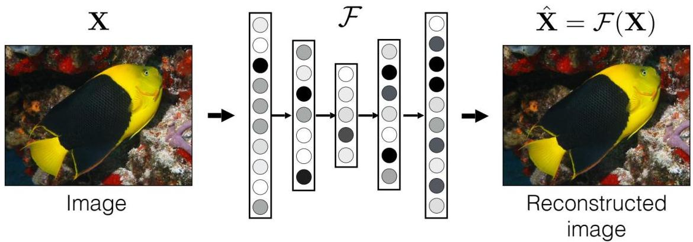

# Autoencoders

Recall: autoencoders as **unsupervised** approaches to representation learning

- goal: learn a compact representation (embedding) to reconstruct input, i.e. $\mathbf{x} \approx d(g(\mathbf{x}))$
- learn the parameters of the encoder $g: X \to Z$ and decoder $d: Z \to X$ minimizing a reconstruction loss such as $\| \hat{\mathbf{x}} - \mathbf{x} \|^2$ where $\hat{\mathbf{x}} = d(g(\mathbf{x}))$

TÉCNICO+

FORMAÇÃO AVANÇADA

arg $\min_{\mathcal{F}} \mathbb{E}_{\mathbf{X}}[||\mathcal{F}(\mathbf{X}) - \mathbf{X}||]$