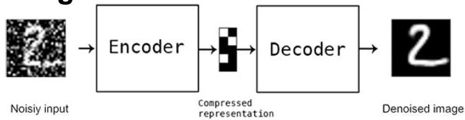
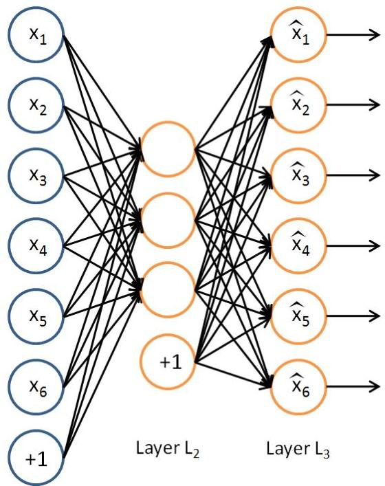

# Autoencoders

- Learning an **autoencoder** ≡ learning a network that learns to predict the input in the output
- Beyond representation...
- compression
- visualization (in lower spaces)
- manifold learning
- denoising

TÉCNICO+
FORMAÇÃO AVANÇADA