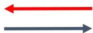
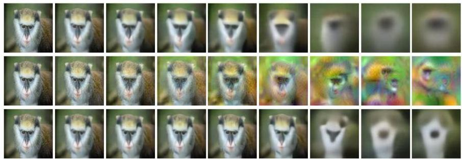

# Explainability

- Meaning of the embedding features
- saliency maps in the original/raw inputs (check our Explainability class)
- Inverting representations (all versus subset of factors)

[81 20 84 64 58 39 17 54 72 15]

TÉCNICO+

FORMAÇÃO AVANÇADA