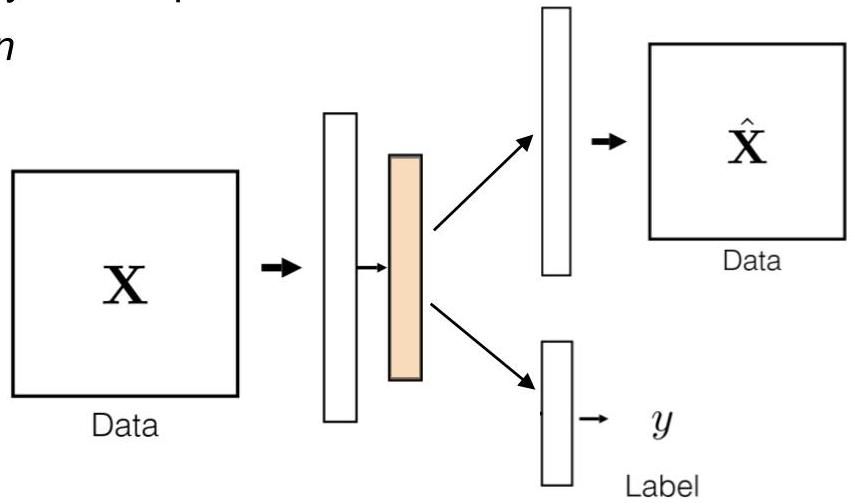

# Hybrid architectures

- Downside of purely unsupervised approaches
- focus on reconstruction may not ensure that the extracted features yield the sufficient predictive power to effectively handle predictive tasks
- Solution: combining supervision and unsupervision
- single encoder
- two decoders
- a dedicated path for the predictive task, other for reconstruction
- loss with two components as well
- parameters of decoders updated simultaneously or alternatively

TÉCNICO+
FORMAÇÃO AVANÇADA