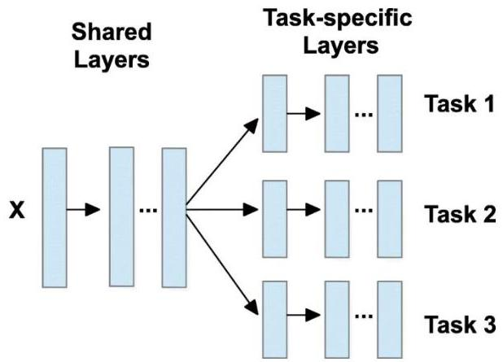

# Multi-task learning

Going beyond two dedicate paths...

- as many paths as relevant predictive/descriptive tasks
- ensure representations are more expressive
- generalizable for multiple downstream ends

## Examples:

- on time series: forecasting, anomaly detection, imputation (reconstructing incomplete observations)
- on text: tagging, syntactic parsing, sentiment analysis, text classification, translation

TÉCNICO+ FORMACÃO AVANÇADA